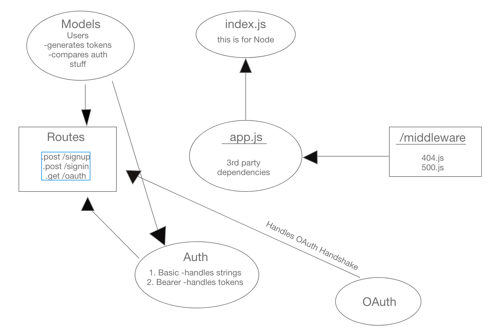

# LAB - 13

## Bearer Authorization

### Author: Adrian Huebner

### Links and Resources
* [submission PR](https://github.com/Adrian-Huebner-401-advanced-javascript/Bearer-Auth/pull/1)
* [travis](https://www.travis-ci.com/Adrian-Huebner-401-advanced-javascript/Bearer-Auth)
* [back-end](https://ah-bearer-auth.herokuapp.com/)

### Modules
#### `user-models.js`

### Setup
#### `.env` requirements
* `PORT` - Port Number
* `MONGODB_URI` - URL to the running mongo instance/db
* `SECRET` - Secret string, whatever you want

#### Running the app
* `npm start`

  
#### Tests
* How do you run tests?
`npm run test`
`npm run lint`

#### UML

